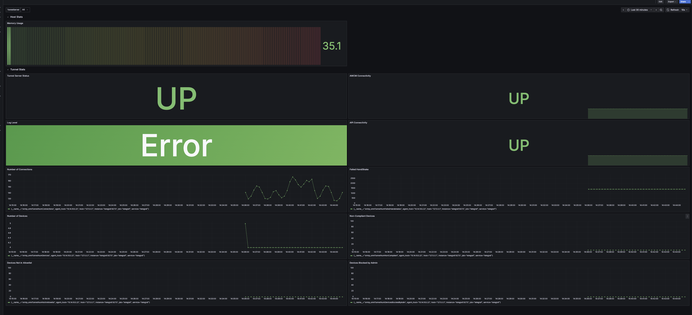

# Overview

This repo can be used as a recommendation for guidance on setting up observability for tunnel server.

## Tunnel Server

### Pre-reqs

* Tunnel configured on UEM Console.Follow the existing steps to enable snmp(if using UAG).
* Tunnel Server deployed through UAG or container
    * Tunnel Server container already exposes port 161 for snmp stats. Only snmp v2 is supported.
* All connectivity should be working as expected and the Observability VM should be able to connect to Tunnel Server

### Telemetry

#### Set Up

* Deploy Linux VM 
    * Chose distribution of your choice, though Alma Linux is recommended for use. You can also choose to download [here](https://almalinux.org/get-almalinux/)
        * Resource recommendation of Linux VM 4 core 16GB 100 GB storage 
    * Ensure, docker and docker-compose is installed on Linux VM. Run `docker version` to confirm the same.
    * Start docker using `systemctl start docker`
* Clone the repo on Linux VM OR download to your local,zip the entire repo and transfer it to VM.
* Login to VM
* Go to directory where repo is cloned or unzip it if zipped.
* open [.env](./.env) file in this directory and fill in the Linux VM IP field to the IP of your VM.
```
TELEGRAF_HOST=<LINUX VM IP>

GRAFANA_PORT=3000
GRAFANA_URL=<LINUX VM IP>
GRAFANA_USER=<GRAFANA USERNAME>
GRAFANA_PASSWORD=<GRAFANA PASSWORD>
GRAFANA_PLUGINS_ENABLED=true
GRAFANA_PLUGINS=grafana-piechart-panel
```
 * open [snmp.conf](https://github.com/euc-oss/omnissa-tunnel-observability/blob/4df6942a9af5a4768136b6a83d6f6d3487381426/telegraf/snmp.conf#L5) file and fill the Tunnel Server IPs to pull stats from.
 ```
 [[inputs.snmp]]
   # Define as "udp://<hostname_or_ip1>:161,udp://<hostname_or_ip2>:161,udp://<hostname_or_ip3>:161"
   # Example: agents = [ "udp://1.2.3.4:161", "udp://3.4.5.6:161" ]
   agents = [ "udp://<Tunnel_Server_1>:161", "udp://<Tunnel_Server_2>:161", ... ]
 ```
* Run :
```
setup.sh with: 
	tunall: if all components need to run
    clean: to cleanup all containers.
```

* Open any browser on your local OR any machine which has connectivity to the Linux VM and type `http://<linux-vm-ip>:3000` 
    * You can view the telemetry here and a default dashboard.

### Tests

1. Enroll a device and try accessing any tunnel’ed resource from any enrolled device. 
2. You should start seeing the stats `http://<linux-vm-ip>:3000`


